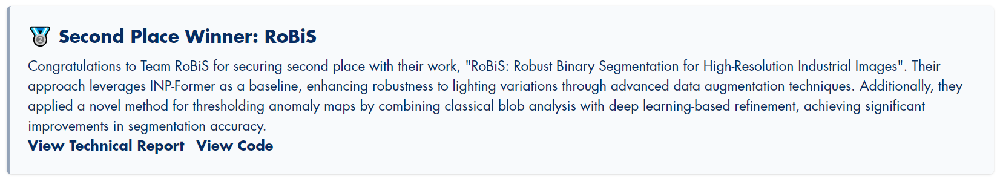

# ✨RoBiS: Robust Binary Segmentation for High-Resolution Industrial Images (*CVPR2025 VAND3.0 挑战赛赛道1的第二名方法*)


作者:
[李煦蕤](https://github.com/xrli-U)<sup>1</sup> | [蒋中盛](https://github.com/FoundWind7)<sup>1</sup> | [艾廷轩](https://aitingxuan.github.io/)<sup>1</sup> | [周瑜](https://github.com/zhouyu-hust)<sup>1,2</sup>

单位:
<sup>1</sup>华中科技大学 | <sup>2</sup>武汉精测电子集团股份有限公司

联系方式:
**xrli\_plus@hust.edu.cn** | zsjiang@hust.edu.cn | tingxuanai@hust.edu.cn | yuzhou@hust.edu.cn

Track: Adapt \& Detect---Robust Anomaly Detection in Real-World Applications

### 技术报告: [ResearchGate](https://www.researchgate.net/publication/392124350_RoBiS_Robust_Binary_Segmentation_for_High-Resolution_Industrial_Images) | [arXiv](https://arxiv.org/pdf/2505.21152) | [PDF](assets/RoBiS.pdf) | [PPT](assets/RoBis_PPT.pdf)

### README: [英文](Readme.md) | 中文


## 🧐概述

该项目是我们在CVPR 2025 VAND3.0 challenge track 1中所提出的**解决方案RoBiS**的官方实现，在该比赛中，我们获得了第二名的好成绩。

我们的RoBiS结合了传统基于统计的*mean+std3* 方法和基于形态学的MEBin方法（是我们发表在CVPR2025上的论文 [github link](https://github.com/HUST-SLOW/AnomalyNCD)）来实现自适应二值化。该策略使我们的方法**无需为每个类别的产品人工确定不同的阈值**。

MVTec基准测试服务器: [https://benchmark.mvtec.com/](https://benchmark.mvtec.com/).

比赛官网: [https://sites.google.com/view/vand30cvpr2025/challenge](https://sites.google.com/view/vand30cvpr2025/challenge)




## 🎯代码环境配置

### 环境:

- Python 3.8
- CUDA 11.7
- PyTorch 2.0.1

使用如下命令克隆该项目到本地:

```
git clone https://github.com/HUST-SLOW/RoBiS.git
```

创建虚拟环境:

```
conda create --name RoBiS python=3.8
conda activate RoBiS
```

安装依赖库:

```
pip install torch==2.0.1 torchvision==0.15.2 torchaudio==2.0.2
pip install -r requirements.txt
```
## 👇数据集下载

通过官方链接([web](https://www.mvtec.com/company/research/datasets/mvtec-ad-2))下载[MVTec AD 2](https://arxiv.org/pdf/2503.21622)数据集 

把所有的数据集都放在`./data`文件夹下，组织形式如下：

```
data
|---mvtec_ad_2
|-----|-- can
|-----|-----|----- test_private
|-----|-----|----- test_private_mixed
|-----|-----|----- test_public
|-----|-----|----- train
|-----|-----|----- validation
|-----|-- fabric
|-----|--- ...
```

## 💎运行RoBiS
在正式运行我们的RoBiS代码之前，执行`download_weights.sh`脚本来下载预训练权重。
```
bash scripts/download_weights.sh
```
我们提供了两种方式运行我们的代码。

### python运行

```
python examples/robis_main.py
```
遵循 `./configs/robis.yaml`中的设置

### shell运行

```
bash scripts/robis.sh
```
脚本`robis.sh`中的设置具有更高的优先级。

关键参数如下:

- `--device`: GPU_id。
- `--dataset_name`: 数据集名称。
- `--original_data_path`: 数据集路径。
- `--data_path`: 预处理裁图后数据集路径。
- `--mvtecad2_class_list`: 进行测试的类别，如果该参数设置为`all`，将对所有的类别进行测试。
- `--test_type`: 测试类型。可选`test_public`，`test_private`，`test_private_mixed`和`validation`。
- `--window_size`: 裁图后图像的尺寸。
- `--desired_overlap`: 裁图后图像的重叠。
- `--save_dir`: 预训练权重的保存路径。该路径将自动创建。
- `--amap_savedir`: 保存预测的异常概率图的路径。该路径将自动创建。
- `--bin_savedir`: 保存二值图的路径。该路径将自动创建。
- `--encoder`: 特征提取器的名称。
- `--input_size`: 图像缩放后的尺寸。
- `--crop_size`: 图像中心裁剪后的尺寸。
- `--INP_num`: INP数量。
- `--total_epochs`: 总训练轮数。
- `--batch_size`: 批大小。
- `--train_state`: 是否训练。
- `--test_state`: 是否测试。
- `--eval_pub`: 是否评估test_public的测试指标。

您可以将`test_private`和`test_private_mixed`两类连续异常图和经过阈值处理的二值掩膜转移到`./submission_folder`以便于压缩与评估。
```
mkdir -p ./submission_folder
cp -r ${amap_savedir}/anomaly_images ./submission_folder/
cp -r ${bin_savedir}/anomaly_images_thresholded ./submission_folder/
```
最终的连续异常图可以在[google drive](https://drive.google.com/file/d/1OqejveTgEuYr9obEUV3h3Vzq2HTp29ua/view?usp=sharing)中下载。
最终的二值化掩膜可以在[google drive](https://drive.google.com/file/d/1ilMnxisuQOYnvllu1kUHaibkzHiHN_R-/view?usp=sharing)中下载。
您还可以通过该链接下载我们训练好的权重[(google drive)](https://drive.google.com/drive/folders/1JvbEru6W1RxThjjiPJSONbO97j9_I6dN?usp=drive_link)。


### 逐步说明介绍
**1.预处理**
```
python models/modules/_swin_cropping.py \
       --original_data_path ./data/mvtec_ad_2 \
       --data_path ./mvtec_ad_2_processed \
       --window_size 1024 \
       --desired_overlap 0.1 \
       --mvtecad2_class_list all
```
使用`_swin_cropping`模块裁图预处理数据。
请预留约50GB空间储存预处理后的数据。

关键参数如下:
- `--original_data_path`: 原始数据集路径。
- `--data_path`: 预处理之后的数据保存路径，该路径将被自动创建。
- `--window_size`: 裁图后图像的尺寸。
- `--desired_overlap`: 裁图后图像的重叠。

**2.模型训练**
```
python models/robis.py \
  --device 0 \
  --original_data_path ./data/mvtec_ad_2 \
  --data_path ./mvtec_ad_2_processed \
  --mvtecad2_class_list all \
  --encoder dinov2reg_vit_base_14 \
  --input_size 518 \
  --crop_size 518 \
  --INP_num 6 \
  --total_epochs 200 \
  --batch_size 16 \
  --save_dir ./saved_weights \
  --amap_savedir ./anomaly_map_results \
  --test_type test_public \
  --train_state
```
我们使用DINOv2-R预训练权重对ViT-B-14进行初始化，将其作为图像编码器。
预训练权重会自动下载到`./backbones/weights/dinov2_vitb14_reg4_pretrain.pth`。

如果要在默认设置下训练异常检测模型，请预留至少17GB的GPU内存。
推荐您使用不同的GPU来训练不同的产品类别，以减少时间消耗。
您也可以通过该链接下载我们训练好的权重[(google drive)](https://drive.google.com/drive/folders/1JvbEru6W1RxThjjiPJSONbO97j9_I6dN?usp=drive_link)。

关键参数如下:
- `--data_path`: 预处理后的数据集路径。
- `--save_dir`: 保存模型权重的路径，该路径将自动创建。
- `--mvtecad2_class_list`: MVTec AD 2数据集的所有产品类别。由于我们的方法为每个产品分别训练一个模型，因此可以使用不同的GPU来训练不同的产品，以减少时间消耗。
- `--encoder`: 特征提取器的名称。
- `--input_size`: 图像缩放后的尺寸。
- `--crop_size`: 图像中心裁剪后的尺寸。
- `--INP_num`: INP数量。
- `--total_epochs`: 总训练轮数。
- `--batch_size`: 批大小。
- `--train_state`: 是否训练。

**3.模型测试**
```
python models/robis.py \
  --device 0 \
  --original_data_path ./data/mvtec_ad_2 \
  --data_path ./mvtec_ad_2_processed \
  --mvtecad2_class_list all \
  --encoder dinov2reg_vit_base_14 \
  --input_size 518 \
  --crop_size 518 \
  --INP_num 6 \
  --batch_size 16 \
  --save_dir ./saved_weights \
  --amap_savedir ./anomaly_map_results \
  --test_type test_public \
  --test_state
```
对选定的测试集类别进行测试。

关键参数如下:
- `--data_path`: 预处理后的数据集路径。
- `--save_dir`: 保存模型权重的路径。 
- `--amap_savedir`: 保存所有子图的异常图*(.tiff)*路径，该路径将自动创建。
- `--test_type`: 选择MVTec AD 2数据集的测试集类型，可设置为*test_private*，*test_private_mixed*，*test_public*，*validation*以满足您不同需求。
- `mvtecad2_class_list`: MVTec AD 2数据集中的类别。
- `--test_state`: 是否测试。

**4.后处理**
```
python models/modules/_merging.py \
    --amap_savedir ./anomaly_map_results \
    --mvtecad2_class_list all \
    --window_size 1024 \
    --desired_overlap 0.1 \
    --test_type test_public
```
使用`_merging`模块将所有子图对应的异常图合并到原始图像对应位置中。

关键参数如下:
- `--amap_savedir`: 保存所有子图的异常图*(.tiff)*路径，合并完成后，子图的异常图将被自动删除。
- `--window_size`: 裁图后图像的尺寸。请保持和预处理相同的参数。
- `--desired_overlap`: 裁图后图像的重叠。请保持和预处理相同的参数。

**5.二值化**
```
# 使用MEBin和mean+3std生成初步二值化掩膜
python models/modules/_binarization.py \
  --amap_savedir ./anomaly_map_results \
  --bin_savedir  ./binary_map_results \
  --mvtecad2_class_list all \
  --test_type test_public

# 使用SAM生成最终二值化掩膜
python models/modules/_SAM_Finer.py \
  --original_data_path ./data/mvtec_ad_2 \
  --mvtecad2_class_list all \
  --test_type test_public \
  --bin_savedir ./binary_map_results \
  --device 0
```
使用`_binarization`模块，结合MEBin和mean+3std生成初步二值化掩膜。
使用`_SAM_finer`生成最终二值化掩膜。
在调用`_SAM_Finer.py`之前，请确保预训练的SAM权重*(sam_b和sam_h)*已下载到当前的路径下，如果没有下载，请运行脚本`bash scripts/download_weights.sh`。

关键参数如下:
- `--amap_savedir`:保存异常图的路径*(.tiff)*。
- `--bin_savedir`:保存阈值化后的二值化掩膜的路径。
- `--original_data_path`:原数据集路径。

**6.评估**
将`test_private`和`test_private_mixed`两类连续异常图和经过阈值处理的二值掩膜转移到`./submission_folder`以便于压缩与评估。
```
mkdir -p ./submission_folder
cp -r ${amap_savedir}/anomaly_images ./submission_folder/
cp -r ${bin_savedir}/anomaly_images_thresholded ./submission_folder/
```
`test_public`可以直接对二值图进行评估。

关键参数如下:
- `--eval_pub`: 是否评估test_public的测试指标。请将其设置为`True`以进行评估。

最终的连续异常图可以在[google drive](https://drive.google.com/file/d/1OqejveTgEuYr9obEUV3h3Vzq2HTp29ua/view?usp=sharing)中下载。
最终的二值化掩膜可以在[google drive](https://drive.google.com/file/d/1ilMnxisuQOYnvllu1kUHaibkzHiHN_R-/view?usp=sharing)中下载。

## 🎖️结果

所有结果均由官方服务器计算得出。

### MVTec AD 2

|   Object    | AucPro_0.05 |  ClassF1  |   SegF1   |   AucPro_0.05   |     ClassF1     |      SegF1      |
| :---------: | :---------: | :-------: | :-------: | :-------------: | :-------------: | :-------------: |
|             |  (private)  | (private) | (private) | (private_mixed) | (private_mixed) | (private_mixed) |
|     Can     |    30.28    |   60.93   |   1.86    |      20.03      |      65.04      |      0.84       |
|   Fabric    |    79.45    |   83.79   |   87.46   |      79.27      |      83.80      |      73.37      |
| Fruit Jelly |    74.46    |   87.35   |   53.63   |      74.11      |      87.55      |      52.62      |
|    Rice     |    62.27    |   72.00   |   63.86   |      63.89      |      73.45      |      63.23      |
| Sheet Metal |    75.51    |   87.68   |   70.98   |      73.54      |      86.69      |      70.92      |
|    Vial     |    76.81    |   84.61   |   48.73   |      69.59      |      85.77      |      48.83      |
| Wall Plugs  |    62.20    |   75.20   |   14.38   |      24.77      |      72.66      |      3.40       |
|   Walnuts   |    77.05    |   85.42   |   67.13   |      72.00      |      83.95      |      58.94      |
|    Mean     |    67.25    |   79.62   |   51.00   |      59.65      |      79.86      |      46.52      |


## 致谢

我们的工作基于[INP-Former](https://github.com/luow23/INP-Former)进行改进，代码写得十分清晰易于学习和扩展，非常感谢！

## License
RoBiS is released under the **MIT Licence**, and is fully open for academic research and also allow free commercial usage. To apply for a commercial license, please contact yuzhou@hust.edu.cn.